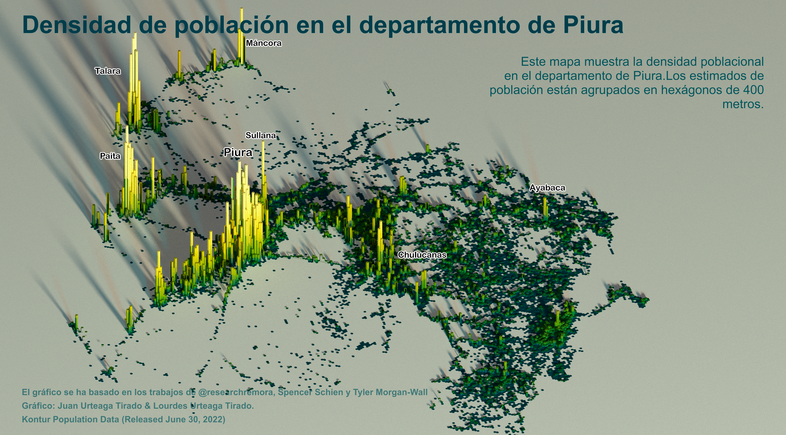
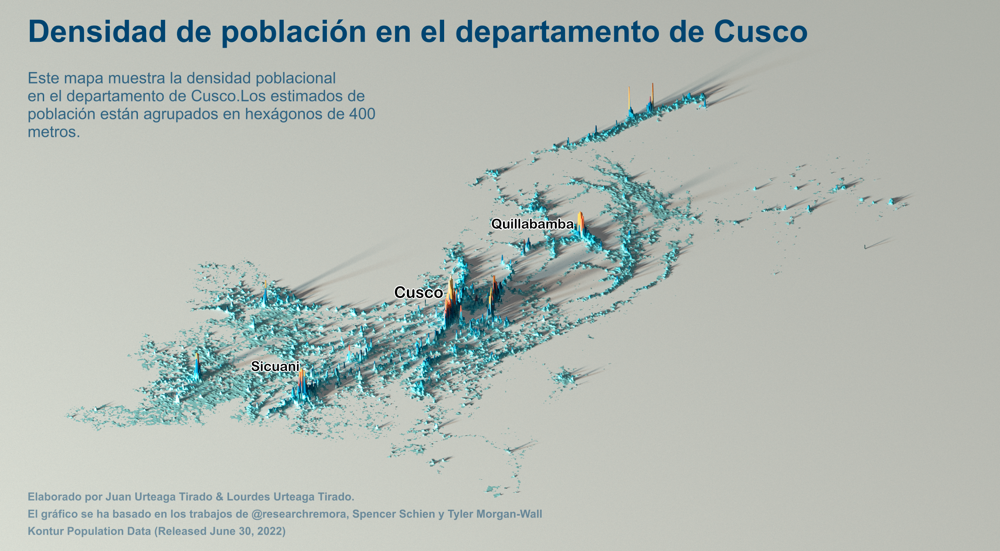
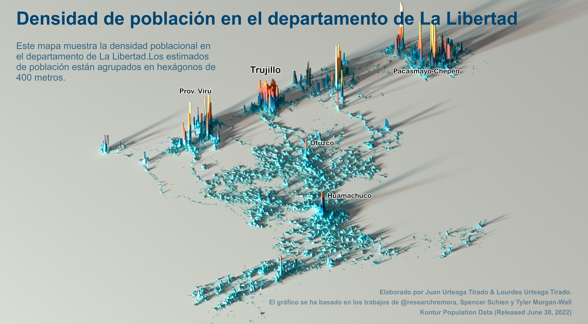
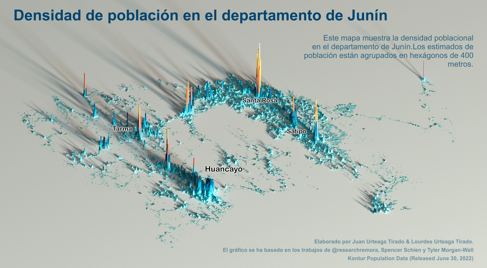
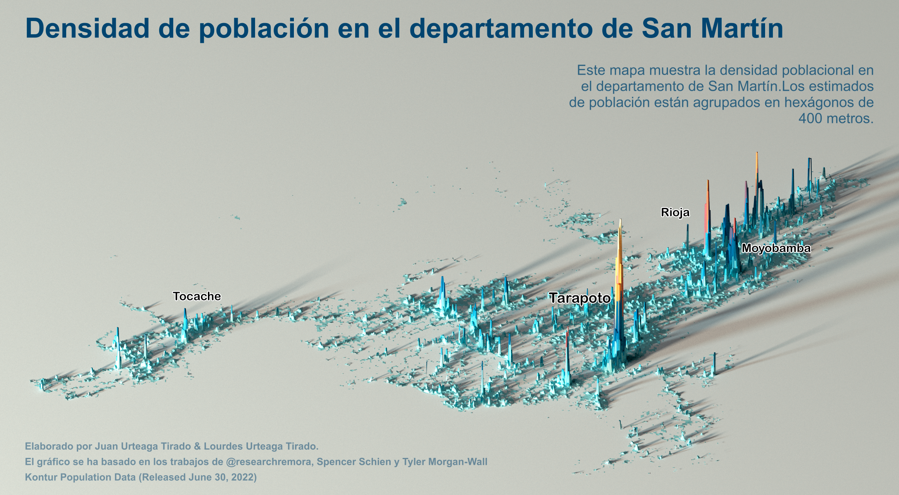

<div class="breadcrumbs">
  <span>Portafolio</span> <span class="sep">></span>
  <span>Visualización espacial 3D de las densidad poblacional en el Perú</span> <span class="sep">></span>
</div>

## Densidades poblacionales en el Perú

### Iniciativa

La base de datos de Kontur sobre población mundial, es una de las fuentes de libre acceso más actualizadas en el campo demográfico. Si bien fue originalmente pensada para su uso en situaciones de emergencia y desastre de gran escala, el utilizar y solicitar mejoras a esta base de datos puede ayudar a resolver muchos más problemas claves en el ámbito territorial.

Por todo ello, estaremos desarrollando para cada departamento una visualización tridimensional que permita facilitar la reflexión sobre la densidad de la población peruana, así como recopilar sugerencias para enviarlas a los desarrolladores de dicha base de datos.

Avanzaremos poco a poco, ¡departamento por departamento...!

### Departamentos

```{=html}
<div class="accordion densidad-acc" id="densidadAccordion">

  <!-- PIURA -->
  <div class="accordion-item">
    <h2 class="accordion-header" id="hPiura">
      <button class="accordion-button collapsed" type="button"
              data-bs-toggle="collapse" data-bs-target="#cPiura"
              aria-expanded="false" aria-controls="cPiura">
        Departamento de Piura
      </button>
    </h2>
    <div id="cPiura" class="accordion-collapse collapse"
         aria-labelledby="hPiura" data-bs-parent="#densidadAccordion">
      <div class="accordion-body densidad-body">
        <div class="densidad-grid">
          <div class="densidad-panel">
            
          </div>
          <div class="densidad-panel densidad-video">
            <iframe
              src="https://www.youtube-nocookie.com/embed/5SgZ25M1ML0?rel=0"
              title="Video: Densidad de población - Piura"
              loading="lazy"
              referrerpolicy="strict-origin-when-cross-origin"
              allow="accelerometer; autoplay; clipboard-write; encrypted-media; gyroscope; picture-in-picture; web-share"
              allowfullscreen></iframe>
          </div>
        </div>
      </div>
    </div>
  </div>

  <!-- CUSCO -->
  <div class="accordion-item">
    <h2 class="accordion-header" id="hCusco">
      <button class="accordion-button collapsed" type="button"
              data-bs-toggle="collapse" data-bs-target="#cCusco"
              aria-expanded="false" aria-controls="cCusco">
        Departamento de Cusco
      </button>
    </h2>
    <div id="cCusco" class="accordion-collapse collapse"
         aria-labelledby="hCusco" data-bs-parent="#densidadAccordion">
      <div class="accordion-body densidad-body">
        <div class="densidad-grid">
          <div class="densidad-panel">
            
          </div>
          <div class="densidad-panel densidad-video">
            <iframe
              src="https://www.youtube-nocookie.com/embed/VIDEO_ID_CUSCO?rel=0"
              title="Video: Densidad de población - Cusco"
              loading="lazy"
              referrerpolicy="strict-origin-when-cross-origin"
              allow="accelerometer; autoplay; clipboard-write; encrypted-media; gyroscope; picture-in-picture; web-share"
              allowfullscreen></iframe>
          </div>
        </div>
      </div>
    </div>
  </div>

  <!-- LA LIBERTAD -->
  <div class="accordion-item">
    <h2 class="accordion-header" id="hLaLibertad">
      <button class="accordion-button collapsed" type="button"
              data-bs-toggle="collapse" data-bs-target="#cLaLibertad"
              aria-expanded="false" aria-controls="cLaLibertad">
        Departamento de La Libertad
      </button>
    </h2>
    <div id="cLaLibertad" class="accordion-collapse collapse"
         aria-labelledby="hLaLibertad" data-bs-parent="#densidadAccordion">
      <div class="accordion-body densidad-body">
        <div class="densidad-grid">
          <div class="densidad-panel">
            
          </div>
          <div class="densidad-panel densidad-video">
            <iframe
              src="https://www.youtube-nocookie.com/embed/VIDEO_ID_LALIBERTAD?rel=0"
              title="Video: Densidad de población - La Libertad"
              loading="lazy"
              referrerpolicy="strict-origin-when-cross-origin"
              allow="accelerometer; autoplay; clipboard-write; encrypted-media; gyroscope; picture-in-picture; web-share"
              allowfullscreen></iframe>
          </div>
        </div>
      </div>
    </div>
  </div>

  <!-- JUNÍN -->
  <div class="accordion-item">
    <h2 class="accordion-header" id="hJunin">
      <button class="accordion-button collapsed" type="button"
              data-bs-toggle="collapse" data-bs-target="#cJunin"
              aria-expanded="false" aria-controls="cJunin">
        Departamento de Junín
      </button>
    </h2>
    <div id="cJunin" class="accordion-collapse collapse"
         aria-labelledby="hJunin" data-bs-parent="#densidadAccordion">
      <div class="accordion-body densidad-body">
        <div class="densidad-grid">
          <div class="densidad-panel">
            
          </div>
          <div class="densidad-panel densidad-video">
            <iframe
              src="https://www.youtube-nocookie.com/embed/VIDEO_ID_JUNIN?rel=0"
              title="Video: Densidad de población - Junín"
              loading="lazy"
              referrerpolicy="strict-origin-when-cross-origin"
              allow="accelerometer; autoplay; clipboard-write; encrypted-media; gyroscope; picture-in-picture; web-share"
              allowfullscreen></iframe>
          </div>
        </div>
      </div>
    </div>
  </div>

  <!-- SAN MARTÍN -->
  <div class="accordion-item">
    <h2 class="accordion-header" id="hSanMartin">
      <button class="accordion-button collapsed" type="button"
              data-bs-toggle="collapse" data-bs-target="#cSanMartin"
              aria-expanded="false" aria-controls="cSanMartin">
        Departamento de San Martín
      </button>
    </h2>
    <div id="cSanMartin" class="accordion-collapse collapse"
         aria-labelledby="hSanMartin" data-bs-parent="#densidadAccordion">
      <div class="accordion-body densidad-body">
        <div class="densidad-grid">
          <div class="densidad-panel">
            
          </div>
          <div class="densidad-panel densidad-video">
            <iframe
              src="https://www.youtube-nocookie.com/embed/VIDEO_ID_SANMARTIN?rel=0"
              title="Video: Densidad de población - San Martín"
              loading="lazy"
              referrerpolicy="strict-origin-when-cross-origin"
              allow="accelerometer; autoplay; clipboard-write; encrypted-media; gyroscope; picture-in-picture; web-share"
              allowfullscreen></iframe>
          </div>
        </div>
      </div>
    </div>
  </div>

  <!-- FEEDBACK -->
  <div class="accordion-item">
    <h2 class="accordion-header" id="hFeedback">
      <button class="accordion-button collapsed" type="button"
              data-bs-toggle="collapse" data-bs-target="#cFeedback"
              aria-expanded="false" aria-controls="cFeedback">
        <strong>Feedback sobre la base de datos</strong>
      </button>
    </h2>
    <div id="cFeedback" class="accordion-collapse collapse"
         aria-labelledby="hFeedback" data-bs-parent="#densidadAccordion">
      <div class="accordion-body">
        <p>Aquí puedes colocar tu formulario o un enlace para enviar sugerencias sobre la base de datos.</p>
      </div>
    </div>
  </div>

</div>

```