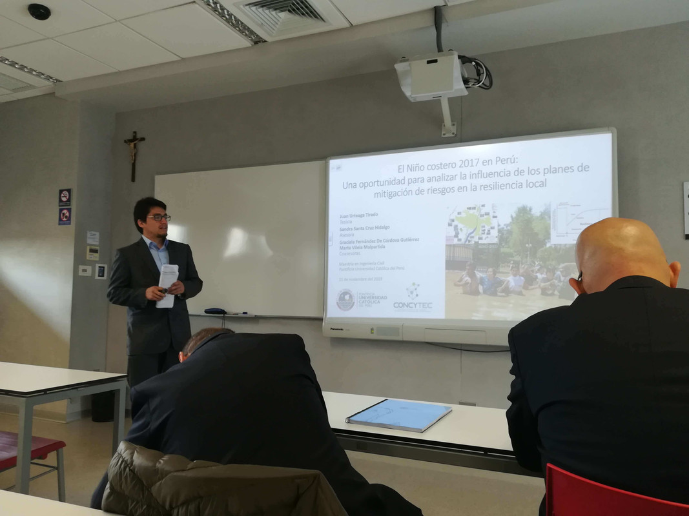
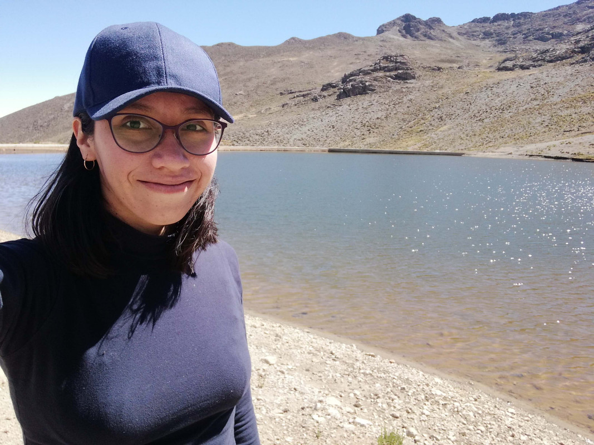

## Equipo de Trabajo {.team-title}

::: {.team-grid}

::: {.team-card}
{.team-photo}

### Mg. Juan Numan Urteaga Tirado {.team-name}

**Consultor**

- Alumno del Advanced Program in Data Science & Global Skills  
  *Aporta y MIT IDSS (Massachusetts Institute of Technology – Institute for Data, Systems and Society), en curso.*
- Mag. Ingeniería Civil  
  *Pontificia Universidad Católica del Perú, 2019.*
- BSc. en Ingeniería Civil  
  *Universidad Nacional de Ingeniería, 2016.*

<button
  type="button"
  class="team-button"
  data-bs-toggle="modal"
  data-bs-target="#teamModal"
  data-name="Mg. Juan Numan Urteaga Tirado"
  data-role="Consultor"
  data-photo="images/juan.jpg"
  data-details="details-juan">
  Ver detalle
</button>
:::

::: {.team-card}
{.team-photo}

### Ing. Lourdes Urteaga Tirado {.team-name}

**Consultora**

Ingeniera Ambiental por la Universidad Nacional de Trujillo (UNT). Cuenta con estudios de maestría en Tratamiento de aguas y desechos por la Universidad Nacional de Ingeniería (UNI) y ha sido becada en Desarrollo web por Platzi y Proinnovate.

<button
  type="button"
  class="team-button"
  data-bs-toggle="modal"
  data-bs-target="#teamModal"
  data-name="Ing. Lourdes Urteaga Tirado"
  data-role="Consultora"
  data-photo="images/lourdes.jpg"
  data-details="details-lourdes">
  Ver detalle
</button>
:::

::: {.team-card}
{.team-photo}

### Reyes de la Cruz Rafael {.team-name}

**Colaborador**

- Ensayos
- Soporte
- Documentación

<button
  type="button"
  class="team-button"
  data-bs-toggle="modal"
  data-bs-target="#teamModal"
  data-name="Reyes de la Cruz Rafael"
  data-role="Colaborador"
  data-photo="images/tierra.gif"
  data-details="details-rafael">
  Ver detalle
</button>
:::

:::


<!-- ===== DETALLES OCULTOS (EN MARKDOWN) ===== -->
::: {.team-details-hidden}

::: {#details-juan .team-detail}
### Perfil
Consultor con enfoque en análisis y estructuración de entregables. Acompaña proyectos con claridad técnica y orden documental.

**Publicaciones:**  
[Abstracts – UEP 2020 Conference](https://sites.google.com/view/uep2020-conference/abstracts?authuser=0)

### Especialidades
- Ciencia de datos aplicada a proyectos.
- Documentación y estandarización de reportes.
- Soporte técnico y metodológico para equipos.

### Formación
- Advanced Program in Data Science & Global Skills (Aporta + MIT IDSS), en curso.
- Magíster en Ingeniería Civil – PUCP (2019).
- Bachiller en Ingeniería Civil – UNI (2016).
:::

::: {#details-lourdes .team-detail}
### Perfil
Ingeniera Ambiental (UNT), con estudios de maestría en Tratamiento de aguas y desechos (UNI). Integra herramientas digitales para mejorar análisis, reportes y comunicación de resultados.

### Áreas de trabajo
- Tratamiento de aguas y residuos.
- Gestión ambiental y soporte técnico.
- Herramientas digitales para análisis y reportes.

### Formación y becas
- Maestría (estudios) – UNI (Tratamiento de aguas y desechos).
- Becas/cursos en Desarrollo web: Platzi y Proinnovate.
:::

::: {#details-rafael .team-detail}
### Perfil
Colaborador enfocado en soporte, documentación y elaboración de contenido escrito. Apoya la comunicación técnica y el orden de información del equipo.

### Contribuciones
- Ensayos y redacción.
- Soporte y ordenamiento de material.
- Documentación técnica para proyectos y entregables.
:::

:::


```{=html}
<!-- ===== MODAL (Bootstrap) ===== -->
<div class="modal fade" id="teamModal" tabindex="-1" aria-hidden="true">
  <div class="modal-dialog modal-dialog-centered modal-lg">
    <div class="modal-content team-modal">

      <div class="modal-header team-modal-header">
        <div class="team-modal-titlewrap">
          <div class="team-modal-title" id="teamModalTitle">Detalle</div>
          <div class="team-modal-role" id="teamModalRole"></div>
        </div>

        <button type="button" class="btn-close team-modal-close" data-bs-dismiss="modal" aria-label="Cerrar"></button>
      </div>

      <div class="modal-body team-modal-body">
        <div class="team-modal-grid">
          <div class="team-modal-left">
            
          </div>

          <div class="team-modal-right">
            <div id="teamModalContent" class="team-modal-content"></div>
          </div>
        </div>
      </div>

    </div>
  </div>
</div>

<script>
document.addEventListener("DOMContentLoaded", () => {
  const modalEl   = document.getElementById("teamModal");
  const titleEl   = document.getElementById("teamModalTitle");
  const roleEl    = document.getElementById("teamModalRole");
  const photoEl   = document.getElementById("teamModalPhoto");
  const contentEl = document.getElementById("teamModalContent");

  modalEl.addEventListener("show.bs.modal", (event) => {
    const btn = event.relatedTarget;
    if (!btn) return;

    const name = btn.getAttribute("data-name") || "Detalle";
    const role = btn.getAttribute("data-role") || "";
    const photo = btn.getAttribute("data-photo") || "";
    const detailsId = btn.getAttribute("data-details");

    titleEl.textContent = name;
    roleEl.textContent  = role;

    if (photo) {
      photoEl.src = photo;
      photoEl.style.display = "";
    } else {
      photoEl.removeAttribute("src");
      photoEl.style.display = "none";
    }

    const detailsNode = detailsId ? document.getElementById(detailsId) : null;

    // Copia el HTML ya renderizado por Quarto
    contentEl.innerHTML = detailsNode
      ? detailsNode.innerHTML
      : "<p>No hay detalles disponibles.</p>";
  });

  modalEl.addEventListener("hidden.bs.modal", () => {
    contentEl.innerHTML = "";
    photoEl.removeAttribute("src");
  });
});
</script>
```

