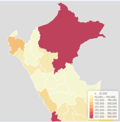
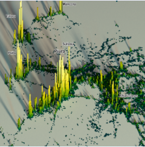

```{=html}
  <div class="portfolio-grid">

    <!-- ✅ Item 1 -->
    <a class="portfolio-card" href="https://jurteagat.notion.site/Toolkit-Gesti-n-Comunitaria-del-Riesgo-de-Desastres-45e7d495c732473d8a15e1a30a7e2255">
      
      <div class="portfolio-body">
        <div class="portfolio-title">Recursos de gestión comunitaria del riesgo de desastres</div>
        <div class="portfolio-desc">Guías, plantillas y material para gestión territorial.</div>
        <div class="portfolio-badge">En elaboración</div>
      </div>
    </a>

    <!-- ✅ Item 2 -->
    <a class="portfolio-card" href="dashboard-damnificados.qmd">
      
      <div class="portfolio-body">
        <div class="portfolio-title">Dashboard de damnificados y viviendas destruidas</div>
        <div class="portfolio-desc">Exploración interactiva por región y distrito.</div>
        <div class="portfolio-badge">En elaboración</div>
      </div>
    </a>

    <!-- ✅ Item 3 -->
    <a class="portfolio-card" href="https://integrandesconsulting.github.io/densidad.html">
      
      <div class="portfolio-body">
        <div class="portfolio-title">Visualización espacial 3D de densidad poblacional en el Perú</div>
        <div class="portfolio-desc">Mapa 3D con capas de exploración y zoom.</div>
        <div class="portfolio-badge">Disponible</div>
      </div>
    </a>

    <!-- ✅ Item 4 (nuevo) -->
    <a class="portfolio-card" href="nuevo-item.qmd">
      
      <div class="portfolio-body">
        <div class="portfolio-title">Nuevo recurso / nuevo item</div>
        <div class="portfolio-desc">Fórmulas y graficas.</div>
        <div class="portfolio-badge">En elaboración</div>
      </div>
    </a>

  </div>
</div>
```